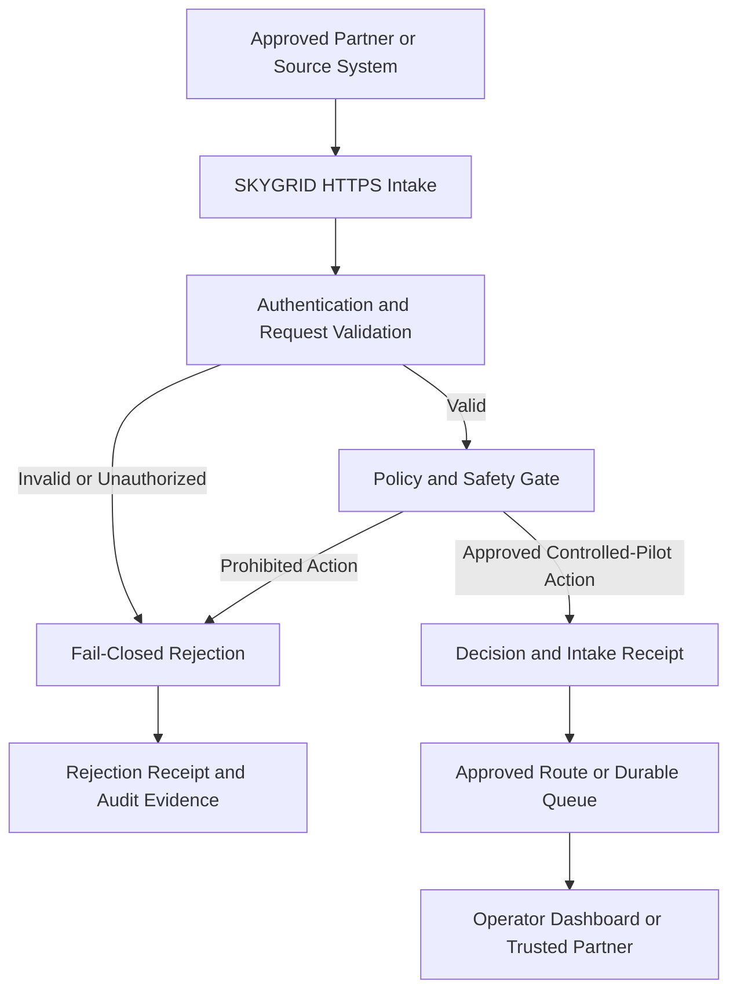

# SKYGRID Emergency Data On-Ramp

## Saleable System Boundary

**Document status:** Controlled-pilot baseline
**Asset:** SKYGRID Emergency Data On-Ramp
**Repository:** Aura-Core
**Owner/operator:** Michael Vincent Patrick
**Purpose:** Define the technical, operational, and transaction boundary of the SKYGRID asset for pilots, investment diligence, licensing, and potential acquisition.

---

## 1. Executive Definition

The **SKYGRID Emergency Data On-Ramp** is a secure HTTPS entry point where emergency, outage, responder, system-health, customer-impact, and continuity data can be:

1. Received
2. Validated
3. Accepted or rejected according to policy
4. Logged
5. Assigned a verifiable receipt
6. Routed through an approved continuity path
7. Surfaced to operators, dashboards, or trusted partners

SKYGRID is not intended to replace a customer’s primary operational systems.

It is designed to provide a lightweight continuity and evidence channel when normal routes are unavailable, congested, degraded, or considered unsafe.

---

## 2. Saleable Asset

The saleable asset is the software, configurations, documentation, operational methods, validation logic, and supporting intellectual property required to deploy and operate the SKYGRID Emergency Data On-Ramp.

The principal product boundary includes:

* Secure HTTP and HTTPS intake interfaces
* Health and runtime identity endpoints
* Request validation and normalization
* Intake policy enforcement
* Fail-closed rejection behavior
* Approved route selection
* Local route preflight
* Route stability and hysteresis logic
* Runtime identity verification
* Decision and intake receipts
* Receipt-integrity verification
* Controlled-pilot training drills
* Accepted-path test scenarios
* Prohibited-path test scenarios
* Operational dashboards and status interfaces
* Local-runtime tooling
* Cloud-runtime tooling
* Deployment and validation automation
* Infrastructure-as-code directly supporting SKYGRID
* Monitoring and diagnostic tooling
* Incident, recovery, and continuity runbooks
* Security and vulnerability-disclosure documentation
* Test collections and machine-verifiable evidence

---

## 3. Core Functional Flow

The controlled-pilot system follows this logical flow:

A request must not be accepted solely because an endpoint is reachable or returns a generic success response.

Runtime identity, product identity, operating mode, sentinel state, requested route, headers, and version should be validated before a route is considered trusted.

---

## 4. Core Components

### 4.1 Intake Interface

The intake interface receives approved controlled-pilot data over HTTP or HTTPS.

Responsibilities include:

* Schema validation
* Required-field validation
* Request-size enforcement
* Content-type enforcement
* Source and authorization checks
* Timestamp and identifier handling
* Duplicate and replay handling
* Policy classification
* Rejection of unsupported operations

### 4.2 Policy and Safety Gate

The policy layer determines whether an action is:

* Allowed
* Rejected
* Operator-gated
* Deferred
* Quarantined
* Unsupported

The default safety posture is fail closed.

An incomplete, ambiguous, unauthorized, malformed, or prohibited request must not be silently treated as approved.

### 4.3 Runtime Identity

A trusted SKYGRID runtime should identify itself using an exact runtime contract.

The controlled-pilot contract includes:

* Product identity
* Runtime identity
* Runtime version
* Controlled-pilot mode
* Fail-closed sentinel state
* Exact route identity
* Matching response headers
* Structured JSON response

A generic response such as `{"ok": true}` is insufficient to establish trusted SKYGRID identity.

### 4.4 Route Preflight

The local route preflight capability evaluates explicitly approved local endpoints and ports.

It does not perform unrestricted subnet discovery.

Route evaluation may include:

* Reachability
* Exact runtime identity
* Repeated successful probes
* Median latency
* Jitter
* Route score
* Current-route state
* Challenger-route improvement
* Consecutive confirmation requirements
* Route-switch cooldown

A route is selected only after required identity and health controls pass.

### 4.5 Receipts and Evidence

SKYGRID generates machine-readable evidence for accepted, rejected, routed, and tested events.

Receipts may include:

* Timestamp
* Run identifier
* Request or scenario identifier
* Decision
* Decision reason
* Route
* Runtime version
* Operating mode
* Sentinel state
* Integrity value
* Test result
* Environment
* Supporting metadata

Receipt integrity may use SHA-256 or HMAC-SHA256 according to deployment configuration.

### 4.6 Operator and Dashboard Surfaces

Operator-facing surfaces may display:

* Runtime health
* Intake status
* Route state
* Accepted events
* Rejected events
* Receipt references
* Continuity conditions
* Partner status
* Controlled-pilot drill results
* Known operational warnings

Dashboards do not independently authorize prohibited actions.

---

## 5. Included Deployment Capabilities

Deployment-related assets are in scope when they directly support SKYGRID operation.

This includes:

* Local Node.js runtime
* Windows PowerShell operational tooling
* Linux operational tooling
* GitHub Actions controlled-pilot verification
* Cloud deployment configurations
* AWS resources directly used by SKYGRID
* Cloudflare edge-worker components directly used by SKYGRID
* Vercel runtime components directly used by SKYGRID
* Kubernetes resources directly used by SKYGRID
* API testing collections
* Health and route checks
* Build and release automation
* Runtime receipts and validation artifacts

A deployment provider is not itself part of the intellectual-property asset.

Cloud accounts, subscriptions, domains, credentials, and provider contracts must be separately identified during diligence and transfer.

---

## 6. Included Intellectual Property

Subject to verification of ownership and third-party licenses, the intended SKYGRID asset includes:

* Source code created for SKYGRID
* Runtime and routing logic
* Validation and policy logic
* Receipt schemas and verification methods
* Controlled-pilot scenarios
* Operational runbooks
* Architecture documentation
* Deployment configurations
* Partner integration patterns
* Dashboard implementations
* Product naming, descriptions, and technical documentation
* Test and verification automation
* Evidence-generation methods
* Security-boundary definitions

Third-party libraries, platforms, hosted services, open-source projects, and provider APIs remain governed by their respective licenses and agreements.

---

## 7. Explicitly Excluded Assets

The following are excluded from the SKYGRID saleable boundary unless separately scheduled in a transaction:

* Personal wallets
* Seed phrases
* Private keys
* Personal cryptocurrency holdings
* Personal financial accounts
* Unrelated NFT or digital-parcel experiments
* Unrelated token-economic experiments
* Veteran-status wallet applications
* Apple presentation materials unrelated to SKYGRID
* Consumer wallet prototypes
* Unrelated payment products
* Unrelated Cascade Tech materials
* Personal devices
* Personal email accounts
* Personal social-media accounts
* Personal cloud resources not required for SKYGRID
* Unrelated Aura-Core experiments
* Third-party customer or partner data
* Third-party software ownership
* Infrastructure-provider intellectual property
* Compliance certifications that have not been obtained
* Production customer contracts that have not been executed
* Claims of revenue that have not been documented

Experimental blockchain settlement components are excluded unless a transaction schedule expressly identifies them as required SKYGRID components.

Scroll may be used as a settlement or evidence layer in specific configurations, but the SKYGRID Emergency Data On-Ramp must remain technically understandable and operable independently of speculative token value.

---

## 8. Prohibited Autonomous Actions

Unless separately designed, reviewed, authorized, and contracted for a specific deployment, SKYGRID does not autonomously:

* Dispatch emergency responders
* Diagnose medical conditions
* Issue clinical instructions
* Initiate law-enforcement action
* Execute financial transactions
* Move customer funds
* Sign wallet transactions
* Broadcast blockchain transactions
* Override customer production systems
* Trigger unrestricted production failover
* Exfiltrate private data
* Route data to unapproved recipients
* Control telecommunications infrastructure
* Control public-safety infrastructure
* Represent itself as a government emergency service

These actions remain prohibited, unsupported, or operator-gated.

---

## 9. Data Boundary

SKYGRID should process only data approved for the applicable deployment.

Controlled-pilot data should preferably be:

* Synthetic
* Redacted
* Tokenized
* Minimally necessary
* Non-production
* Explicitly authorized

A production deployment must define:

* Permitted data categories
* Prohibited data categories
* Data owner
* Data controller
* Data processor
* Retention period
* Deletion method
* Encryption requirements
* Access roles
* Geographic restrictions
* Backup policy
* Incident-notification requirements
* Partner-sharing rules

No general claim is made that the repository is compliant with HIPAA, SOC 2, PCI DSS, FedRAMP, CJIS, ISO 27001, NIST, StateRAMP, or another regulatory framework.

---

## 10. Security Boundary

The security boundary includes controls that determine whether an intake request, runtime, route, receipt, operator, or partner should be trusted.

Primary controls include:

* Fail-closed behavior
* Exact runtime identity validation
* Request and schema validation
* Explicit host and route allowlists
* Operator approval boundaries
* Secret isolation
* Least-privilege access
* Receipt integrity
* Controlled deployment modes
* Security testing
* Dependency and secret scanning
* Incident response
* Credential rotation
* Audit and evidence retention

The presence of a security control in source code does not prove that every deployment has configured or operated it correctly.

Deployment-specific verification remains necessary.

---

## 11. Operational Boundary

SKYGRID operation requires documented ownership of:

* Source repository
* Deployment accounts
* Domains and DNS
* Cloud credentials
* Secrets
* Build pipelines
* Runtime environments
* Monitoring
* Incident response
* Backup and restoration
* Partner configuration
* Access revocation
* Receipt retention
* Cost management

During an investment or acquisition, personal founder-controlled accounts should be migrated to company-controlled or buyer-controlled accounts according to an approved transfer plan.

---

## 12. Current Maturity

The present system should be described as a:

> **Controlled-pilot emergency and continuity data on-ramp with cross-platform verification, fail-closed policy controls, runtime identity validation, route preflight, and machine-readable operational evidence.**

Current demonstrated capabilities include:

* Windows controlled-pilot verification
* Linux controlled-pilot verification
* Accepted-path drills
* Fail-closed drills
* Receipt verification
* Runtime health contract
* Local route preflight
* Runtime identity validation
* GitHub Actions automation
* IOC monitoring
* Security disclosure policy

The system must not yet be represented as universally production-ready, independently audited, fully compliant, or certified for unrestricted critical-infrastructure operation.

---

## 13. Known Limitations

Known diligence and operational limitations include:

* Some cloud accounts remain founder-controlled.
* Some deployment paths may depend on personal provider accounts.
* Vercel deployment checks are currently affected by an account restriction.
* No independent penetration test has yet been completed.
* No SOC 2 or equivalent audit has been completed.
* Production service-level performance has not yet been established.
* Long-duration production reliability history is not yet available.
* A complete company-owned account-transfer plan remains to be documented.
* Formal customer pilots and revenue must be separately evidenced.
* Infrastructure costs and unit economics require continued measurement.
* Unrelated Aura-Core experiments remain present in the broader repository.
* The saleable SKYGRID boundary must continue to be separated and documented.

These limitations are recorded for remediation and must not be concealed during diligence.

---

## 14. Transaction Boundary

A potential investment, license, or acquisition may include one or more of the following:

### Asset acquisition

Transfer of specified source code, documentation, configurations, domains, and intellectual property.

### Equity investment

Investment in an entity that owns or is assigned the SKYGRID intellectual property and operates the service.

### Commercial license

Permission to deploy or integrate specified SKYGRID components under a defined license.

### Pilot sponsorship

Funding of a controlled deployment, validation exercise, or partner-specific integration.

### Strategic partnership

Joint operation, distribution, integration, hosting, or market development.

The exact transaction must identify:

* Included repositories
* Included branches and releases
* Included domains
* Included cloud resources
* Included documentation
* Included intellectual property
* Included trademarks
* Included contracts
* Included customer relationships
* Excluded personal assets
* Third-party dependencies
* Assumed liabilities
* Required assignments and consents

---

## 15. Transferability Requirements

Before the asset is considered fully transferable, the following should be completed:

* Confirm contributor and founder IP assignments
* Inventory third-party licenses
* Establish a canonical release
* Document fresh deployment
* Document rollback
* Document backup and restoration
* Inventory every required cloud resource
* Separate personal and company credentials
* Establish role-based access
* Document domain ownership
* Establish credential-rotation procedures
* Verify build reproducibility
* Verify receipt integrity
* Document operating costs
* Document known risks
* Complete a clean-room deployment exercise
* Record a controlled-pilot demonstration
* Establish a buyer or company account-transfer procedure

---

## 16. Acceptance Criteria for the Saleable Boundary

The SKYGRID asset boundary is considered adequately documented when:

1. An independent engineer can identify all required components.
2. An independent engineer can distinguish SKYGRID from unrelated Aura-Core experiments.
3. Every required provider account and resource is inventoried.
4. Every external dependency is identified.
5. Every major data flow is documented.
6. Every trust boundary is documented.
7. Every prohibited autonomous action is explicit.
8. A fresh controlled-pilot deployment can be reproduced.
9. Accepted and rejected paths generate verifiable evidence.
10. Known limitations and external account restrictions are disclosed.
11. The asset can be transferred without exposing personal credentials or unrelated personal assets.
12. The transaction schedule can identify exactly what a buyer, licensee, or investor receives.

---

## 17. Governing Product Statement

The governing description of the asset is:

> **SKYGRID Emergency Data On-Ramp is a secure HTTPS entry point where emergency, outage, responder, system-health, customer-impact, and continuity data is validated, logged, routed, proved, and surfaced to dashboards or trusted partners.**

Implementation technology may change without changing this product identity.

SKYGRID must not be renamed solely according to an implementation pattern, hosting platform, blockchain, cloud service, or deployment provider.

---

## 18. Document Control

This document should be reviewed whenever:

* The product boundary changes
* A new production dependency is introduced
* A new regulated data category is accepted
* An autonomous capability is proposed
* A provider account becomes required
* Intellectual property is added or transferred
* A controlled pilot becomes a production deployment
* An investment, license, or acquisition process begins

Changes should be version-controlled and reviewed through the repository’s normal pull-request process.
