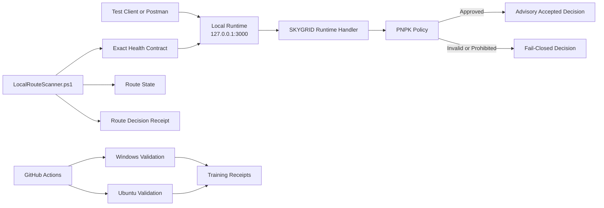
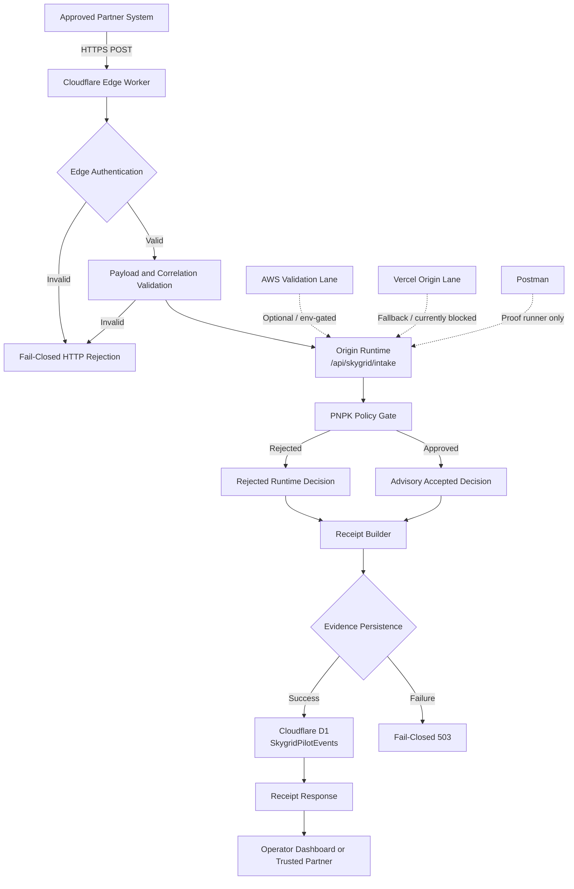
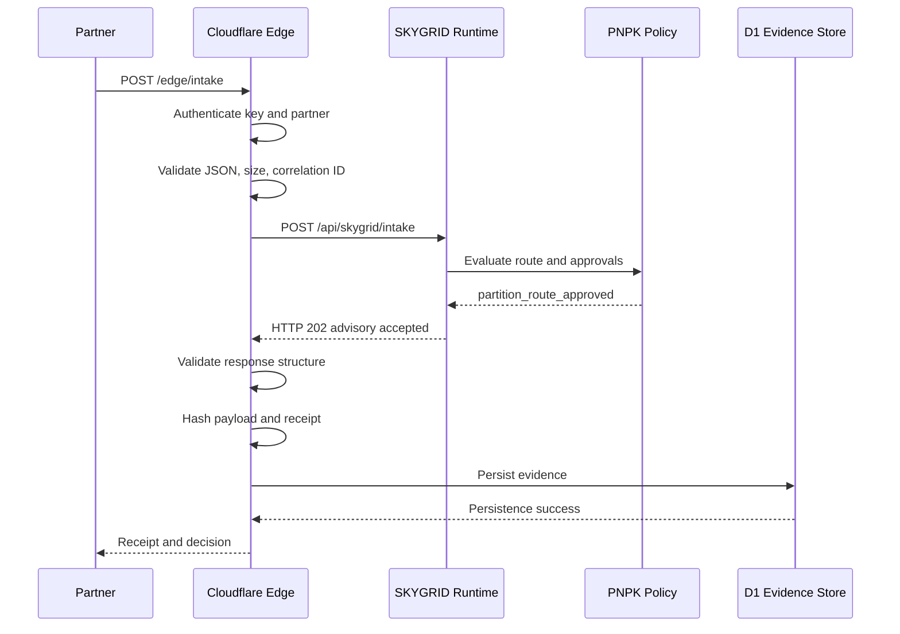
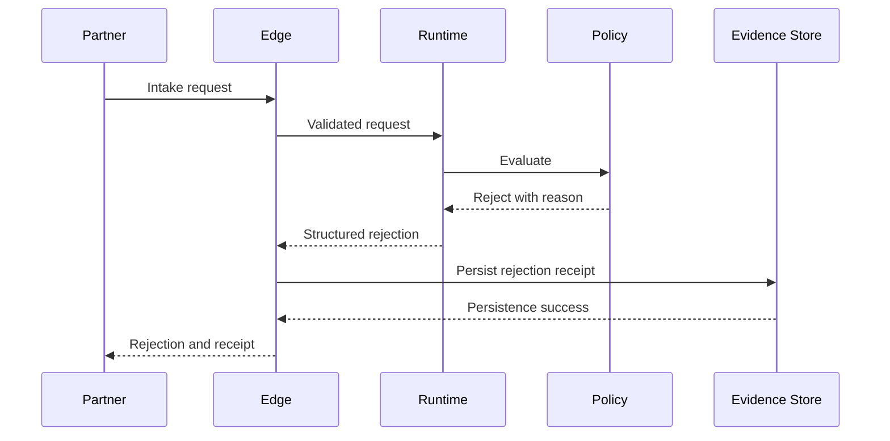
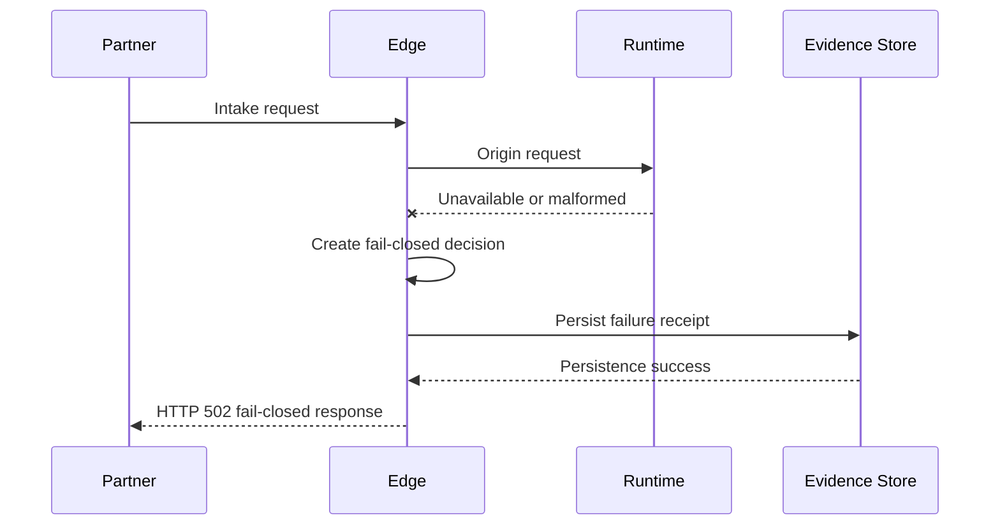
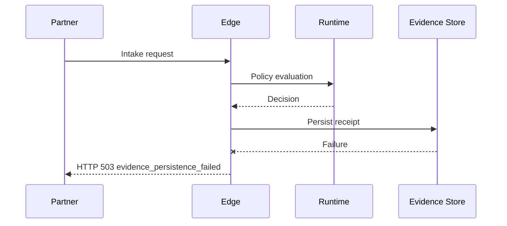
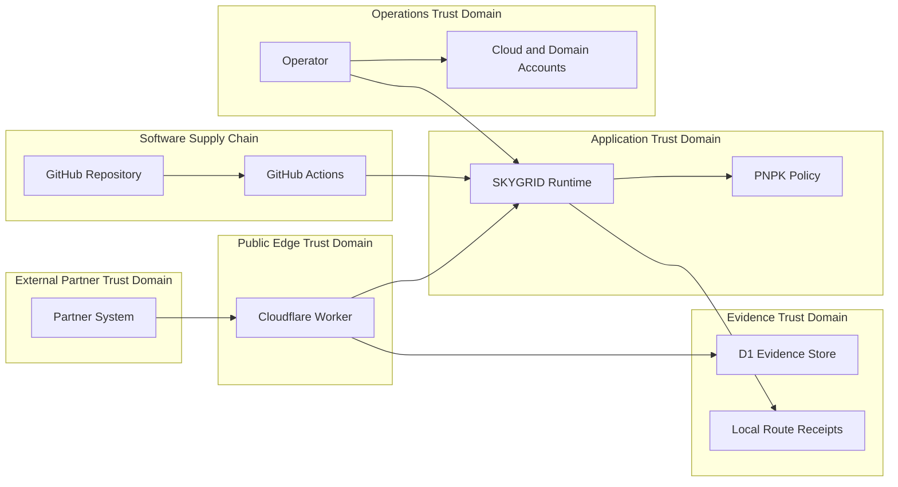

# SKYGRID Emergency Data On-Ramp
## Architecture Baseline

**Document status:** Controlled-pilot diligence baseline  
**Document owner:** Michael Vincent Patrick  
**System:** SKYGRID Emergency Data On-Ramp  
**Repository:** Aura-Core  
**Architecture version:** 1.0  
**Last updated:** 2026-07-16  
**Related document:** `docs/diligence/00-SYSTEM-BOUNDARY.md`

---

## 1. Purpose

This document defines the current architecture of the **SKYGRID Emergency Data On-Ramp** for engineering review, investor diligence, commercial pilots, licensing, and potential acquisition.

It distinguishes between:

1. **Proven controlled-pilot topology** — components currently validated by local or automated evidence.
2. **Declared target topology** — components represented in policy or source code but requiring deployment or production verification.
3. **Optional or experimental integrations** — components that are not required for the core saleable system.

This distinction prevents planned, configured, or partially implemented infrastructure from being represented as fully operational.

---

## 2. Governing Product Definition

The **SKYGRID Emergency Data On-Ramp** is a secure HTTPS entry point where emergency, outage, responder, system-health, customer-impact, and continuity data is validated, logged, routed, proved, and surfaced to dashboards or trusted partners.

SKYGRID is not intended to replace a partner's primary system.

Its purpose is to provide a controlled continuity and evidence path when normal systems are unavailable, congested, degraded, or considered unsafe.

---

## 3. Architectural Principles

SKYGRID follows these governing principles:

### 3.1 Fail closed

A request, route, runtime, or dependency that cannot be positively verified must not be silently approved.

### 3.2 Explicit identity

A generic HTTP success response is insufficient. Trusted runtimes must return the expected product, runtime, version, mode, sentinel, route, content type, and identity headers.

### 3.3 Operator-gated activation

The controlled-pilot architecture does not autonomously perform production failover, emergency dispatch, payment execution, wallet signing, transaction broadcasting, device activation, or private-data movement.

### 3.4 Evidence before activation

Accepted and rejected decisions should produce structured evidence suitable for later verification.

### 3.5 Approved routes only

Routing operates from explicit policy partitions, allowed ramps, allowed node groups, approved health paths, and controlled host lists.

### 3.6 Separation of planning and execution

Quote, advisory, simulation, and routing-planning functions must not be treated as authorization to execute a financial, blockchain, dispatch, or production action.

### 3.7 Transferable operations

The system should be deployable, validated, monitored, and transferred without relying on undocumented founder-only knowledge.

---

## 4. Architecture Status Model

Every component in this document is assigned one of four statuses.

| Status | Meaning |
|---|---|
| **Proven** | Verified by current local execution or automated CI evidence |
| **Implemented** | Present in source code but not fully verified in the current environment |
| **Declared** | Represented in policy or configuration but requires deployment validation |
| **Excluded** | Not required for the core SKYGRID saleable boundary |

---

## 5. Proven Controlled-Pilot Topology

The currently proven topology is local and CI-centered.



### Proven components

- Local Node.js runtime bound to `127.0.0.1`
- Shared SKYGRID runtime handler
- Exact health and runtime identity contract
- PNPK policy loading
- Fail-closed prohibited-action enforcement
- Partition, ramp, and node validation
- Dual-approval policy checks
- Accepted-path training drills
- Fail-closed training drills
- Windows CI validation
- Ubuntu CI validation
- Local route preflight
- Route-selection hysteresis
- Local route-state records
- SHA-256 route-decision receipts
- Optional HMAC-SHA256 route receipt signing
- IOC monitoring
- Repository security policy

This topology is the current **canonical evidence topology**.

It proves application behavior and operational controls but is not by itself a production multi-region deployment.

---

## 6. Declared Target Topology

The policy registry declares a Cloudflare-first edge architecture with an origin runtime and provider-specific supporting lanes.



### Target responsibilities

- **Cloudflare Worker:** public ingress, pilot authentication, payload limits, correlation handling, origin call, response-structure validation, receipt construction, and evidence persistence.
- **Origin runtime:** shared health, intake, routing, policy, dashboard, and advisory decision behavior.
- **PNPK policy:** approved route partitions, allowed ramps, allowed node groups, prohibited actions, and dual-approval requirements.
- **D1 evidence store:** durable controlled-pilot event receipts.
- **Operator surfaces:** status, validation, deployment review, receipts, and manual decision support.
- **AWS lane:** emergency validation or durable supporting services where explicitly configured.
- **Vercel lane:** fallback or public origin hosting where account and deployment status are verified.
- **Postman:** validation and proof execution, not a production message transport.

---

## 7. Topology Reconciliation

The repository currently contains a topology mismatch that must be documented openly.

### Policy-declared topology

The PNPK policy declares:

- Cloudflare Worker as enabled and primary
- Vercel as enabled and fallback
- AWS Lambda as an emergency validation runtime
- Postman as a guardrail proof runner

### Runtime identity

The shared public runtime currently identifies itself as:

```text
runtime: vercel-aura-core
```

### Current operational evidence

The strongest current evidence comes from:

- Local runtime execution
- Windows GitHub Actions
- Ubuntu GitHub Actions
- Local route-scanner verification
- Training receipt verification

### Current Vercel condition

Vercel deployment checks are blocked by an external account condition.

### Architecture decision

Until public lanes are independently revalidated:

- The **local and CI topology** is the canonical proven topology.
- Cloudflare is the **declared primary edge target**.
- Vercel is an **implemented but externally blocked fallback lane**.
- AWS is an **env-gated supporting lane**.
- No public hosting provider should be described as production-active without current route and account evidence.

---

## 8. Component Architecture

## 8.1 Partner or source system

**Status:** External trust domain

A source system may submit approved emergency, outage, responder, system-health, customer-impact, diagnostic, autodrill, recovery-proof, or continuity-log data.

The source system is responsible for:

- Possessing authorized credentials
- Supplying an approved partner identifier
- Generating a valid correlation identifier
- Sending an allowed payload type
- Avoiding prohibited or regulated data outside the pilot agreement
- Retaining its own source-system evidence

The source system must not assume acceptance solely from network delivery.

---

## 8.2 Cloudflare edge worker

**Status:** Implemented; live deployment verification required

Primary routes include:

- `POST /edge/intake`
- `GET /edge/health`
- `GET /edge/d1/health`
- `GET /edge/proof`

Responsibilities:

- Require POST for intake
- Authenticate with `x-skygrid-pilot-key`
- Require `x-skygrid-partner-id`
- Compare the pilot key using constant-time comparison
- Limit pilot payloads to 16,384 bytes
- Require valid JSON objects
- Require a correlation identifier
- Forward approved payloads to `/api/skygrid/intake`
- Validate that origin decisions are structurally safe
- Convert malformed or unavailable origin responses into fail-closed decisions
- Generate payload and receipt hashes
- Persist evidence to D1
- Reject duplicate partner-and-correlation combinations
- Return 503 if evidence persistence fails

The edge worker is a security boundary, not only a proxy.

---

## 8.3 Shared runtime handler

**Status:** Proven locally and in CI; public deployment varies by provider

The runtime handler provides:

- Canonical product identity
- Runtime identity and version
- Health routes
- Dashboard routes
- Intake routes
- Policy decisions
- Failover status
- Proof and autodrill status
- Quote-only demonstration routes
- Controlled-pilot sandbox ingestion
- Route-not-found behavior

Primary health routes include:

- `/health.json`
- `/api/health`
- `/api/status`
- `/api/skygrid/status`
- `/api/highway/status`

Primary intake and decision routes include:

- `/api/skygrid/intake`
- `/intake`
- `/api/aura-core/decide`
- `/api/agent/signals`

The runtime emits:

- `X-SKYGRID-Product`
- `X-SKYGRID-Runtime`
- JSON content type
- `Cache-Control: no-store`

The health payload identifies:

- Product
- Runtime
- Version
- Controlled-pilot mode
- Fail-closed sentinel
- Exact requested route
- Configuration flags
- Launch-ladder state
- Supported routes
- Timestamp

---

## 8.4 Local runtime adapter

**Status:** Proven

The local adapter:

- Imports the shared runtime handler
- Exposes it through Express
- Binds only to `127.0.0.1`
- Uses port `3000` by default
- Allows a CLI or environment port override
- Returns a structured error response if the handler fails

Binding to loopback limits unintended LAN exposure during development and controlled-pilot testing.

---

## 8.5 PNPK policy layer

**Status:** Proven as a loaded runtime policy; policy contents require continuing governance

The PNPK policy is the central route and action policy.

It defines:

- Controlled-pilot mode
- Fail-closed sentinel
- Prohibited runtime actions
- Health and proof routes
- Platform registry
- Active-ramp policy
- Provisioning-router behavior
- Route partitions
- Allowed ramps
- Allowed node groups
- Dual-approval requirements
- Quote-only blockchain behavior
- Blocked AI-switch actions

### Prohibited actions

The policy blocks:

- Payment execution
- Wallet signing
- Transaction broadcasting
- Device activation
- Production failover
- Private-data movement
- RF control
- Nuisance-signal output

### Dual approval

For covered route types, both of the following are required:

- Owner approval
- Emergency-operator approval

Missing approval results in fail-closed rejection.

---

## 8.6 Decision engine

**Status:** Proven

The decision engine performs the following sequence:

1. Normalize routing fields from the request body, nested event, or nested payload.
2. Reject prohibited execution requests.
3. Require route type, requested ramp, and requested node.
4. Locate the requested policy partition.
5. Verify that the ramp is allowed.
6. Verify that the node group is allowed.
7. Apply dual approval when required.
8. Return an advisory accepted decision or a structured rejection.

An approved decision returns HTTP 202 and identifies:

- Selected partition
- Selected ramp
- Selected node group
- Mode
- Sentinel
- Decision reason

An accepted decision remains advisory in the controlled-pilot runtime.

---

## 8.7 Local route preflight

**Status:** Proven

The local route scanner evaluates only explicitly allowed hosts, ports, and health paths.

Default scope includes:

- `127.0.0.1`
- `host.docker.internal`
- The selected local adapter address
- Port `3000`
- Approved health routes

It does not perform an unrestricted subnet sweep.

### Identity verification

A lane must provide:

- HTTP success
- JSON content type
- Exact product header
- Runtime header
- `ok: true`
- Exact product value
- Exact SKYGRID value
- Expected runtime identity
- Controlled-pilot mode
- Fail-closed sentinel
- Exact requested route
- Nonempty version
- Matching header and payload version

### Stability controls

The scanner uses:

- Repeated probes
- Minimum verified-success threshold
- Median latency
- Jitter
- Route score
- Material-improvement threshold
- Consecutive challenger confirmations
- Switch cooldown
- Current-route retention

### Fail-closed state

When no lane is verified:

- State becomes `OFFLINE`
- Decision becomes `FAIL_CLOSED`
- Traffic should remain in a durable queue
- No route should be activated

---

## 8.8 Route state and local receipts

**Status:** Proven

Local route state is written under:

```text
Aura/State/active-route.json
```

Route-decision receipts are written under:

```text
Aura/State/RouteReceipts/
```

The receipt includes:

- Schema
- Decision identifier
- Observation time
- Product
- Mode
- Sentinel
- Decision and reason
- Thresholds
- Allowed scan scope
- Adapter snapshot
- Previous route
- Selected route
- Pending candidate
- Probe evidence
- SHA-256 integrity value
- Optional HMAC-SHA256 signature

Runtime state and receipts are operational artifacts and should not be committed unless intentionally preserved as sanitized evidence.

---

## 8.9 Cloudflare D1 evidence store

**Status:** Implemented; deployment verification required

The controlled-pilot evidence model stores:

- Event ID
- Partner ID
- Correlation ID
- Receipt timestamp
- Route type
- Requested ramp
- Requested node
- Decision result
- HTTP status
- Decision reason
- Mode
- Sentinel
- Approval flags
- Payload hash
- Payload size
- Receipt hash
- Processing time
- Aura validation flag
- Receipt version

The edge intake fails closed if D1 is unavailable or persistence fails.

The evidence store is not described as a general customer-data database. Its intended role is controlled-pilot decision evidence.

---

## 8.10 Operator dashboards

**Status:** Implemented; primarily explanatory and review-oriented

Dashboard routes include:

- `/dashboard/command-center`
- `/dashboard/validation-panel`
- `/dashboard/deployment-review`
- `/dashboard/receipts`

The dashboards surface:

- Canonical front page
- Health
- Proof lane
- Failover status
- Deployment review
- Receipt references
- Launch-ladder status

They do not independently override policy or authorize prohibited actions.

---

## 8.11 GitHub Actions verification

**Status:** Proven

The controlled-pilot workflow validates the code on:

- Windows
- Ubuntu

The workflow performs:

- Dependency installation
- PNPK validation
- Partition verification
- Autodrill checks
- Emergency-gate checks
- Intake-policy checks
- Runtime startup
- Health verification
- Accepted-path training
- Fail-closed training
- Receipt verification
- Artifact upload
- Cleanup

GitHub Actions is part of the evidence and release-control plane, not the production data plane.

---

## 8.12 IOC monitoring

**Status:** Proven

IOC monitoring provides repository-level checks for indicators or patterns designated as suspicious.

It is a supporting security control and does not replace:

- Secret scanning
- Dependency scanning
- Static analysis
- Runtime monitoring
- Incident response
- Independent security review

---

## 8.13 AWS lane

**Status:** Declared and env-gated; full canonical deployment verification required

The runtime exposes configuration flags for:

- AWS status URL
- AWS intake URL
- Lambda router URL
- S3 bucket
- Emergency call identifier
- Partnership code

The PNPK policy assigns AWS Lambda an emergency-validation role operating in controlled-pilot advisory mode.

AWS may provide:

- Validation
- Durable storage
- Messaging
- Monitoring
- Regional continuity
- Supporting API routes

AWS should not be represented as the canonical active production lane until the required resources, account ownership, regions, IAM controls, and live route tests are documented.

---

## 8.14 Vercel lane

**Status:** Implemented fallback; currently externally blocked

The shared runtime is compatible with a Vercel-hosted origin and currently identifies itself as `vercel-aura-core`.

The policy lists primary and secondary Vercel ramp candidates.

Current diligence condition:

- Multiple Vercel checks report that the account is blocked.
- Those checks are external account failures, not failures of the Windows or Ubuntu controlled-pilot workflow.
- Vercel must not be treated as a reliable production dependency until account ownership and deployment access are restored or the dependency is removed.

---

## 8.15 Postman proof lane

**Status:** Proven as a validation mechanism

Postman collections and related scripts validate:

- Front page
- Health
- Status
- Intake
- Dashboard
- Failover status
- Accepted paths
- Fail-closed paths

Postman is a test and proof runner.

It is not a durable queue, trusted identity provider, primary database, or production emergency transport.

---

## 8.16 Kubernetes and EKS

**Status:** Supporting or experimental until revalidated

Kubernetes and EKS resources may support:

- Replicated workers
- Validation nodes
- Regional deployment
- Auto-drill processing
- Service isolation

They are not required for the current proven local controlled-pilot topology.

Before inclusion in a saleable canonical architecture, they require:

- Current cluster inventory
- Current version and lifecycle status
- Namespace and workload inventory
- IAM and service-account review
- Network-policy review
- Storage review
- Fresh deployment validation
- Cost measurement
- Backup and recovery procedures

---

## 8.17 Blockchain or settlement integrations

**Status:** Optional; excluded from core execution

The PNPK policy permits quote and planning concepts for approved blockchain ramps but prohibits:

- Wallet signing
- Transaction broadcasting
- Payment execution

Scroll may be used as an optional evidence or settlement layer in a separately approved configuration.

The SKYGRID Emergency Data On-Ramp must remain deployable and commercially understandable without dependence on speculative token value or autonomous blockchain execution.

---

## 9. Primary Data Flow

## 9.1 Accepted controlled-pilot request



The request is considered accepted only after:

- Edge authentication succeeds
- Payload validation succeeds
- Runtime decision structure is safe
- PNPK policy approves the route
- Required approvals are present
- Evidence persistence succeeds

---

## 9.2 Rejected request



A rejected decision remains useful evidence.

It should not be converted into an accepted state by a dashboard, downstream client, or transport retry.

---

## 9.3 Runtime unavailable



---

## 9.4 Evidence persistence unavailable



A successful runtime decision is not returned as accepted when required evidence persistence fails.

---

## 10. Trust Boundaries



### Boundary 1: Partner to edge

Controls:

- HTTPS
- Pilot API key
- Partner identifier
- Correlation identifier
- Payload-size limit
- JSON validation
- Pilot data restrictions

### Boundary 2: Edge to runtime

Controls:

- Known origin
- JSON-only request
- Partner and correlation propagation
- Origin response parsing
- Structural policy validation
- Fail-closed origin handling

Future hardening:

- Mutual TLS or signed edge-to-origin requests
- Origin allowlisting
- Replay-window enforcement
- Request timestamp and nonce
- Provider-level origin access control

### Boundary 3: Runtime to policy

Controls:

- Repository-controlled PNPK file
- Explicit partitions and allowlists
- Prohibited-action checks
- Dual approval
- Fail-closed default

Future hardening:

- Signed policy bundles
- Policy schema validation at startup
- Policy version pinning
- Independent policy tests
- Controlled policy deployment

### Boundary 4: Edge to evidence store

Controls:

- Bound D1 database
- Unique correlation handling
- Payload and receipt hashes
- Fail closed on persistence failure

Future hardening:

- Retention and deletion policy
- Encryption and access review
- Backup and restoration
- Receipt-chain or external timestamp proof
- Tenant-level access controls

### Boundary 5: Operator to infrastructure

Controls required:

- MFA
- Role-based access
- Least privilege
- Separate production and development access
- Credential rotation
- Account-recovery process
- Change approval
- Audit logs

### Boundary 6: Source to deployment

Controls currently represented:

- Git version history
- Pull request workflow
- Cross-platform CI
- Receipt artifacts
- Security policy
- IOC checks

Future hardening:

- Required reviews
- Protected branches
- Signed releases
- SBOM generation
- Dependency scanning
- Secret scanning
- Static analysis
- Artifact provenance

---

## 11. Security Control Matrix

| Control | Location | Status |
|---|---|---|
| Fail-closed runtime policy | Runtime and PNPK | Proven |
| Exact health identity | Runtime and route scanner | Proven |
| Loopback-only local bind | Local runtime | Proven |
| Explicit route and node allowlists | PNPK | Proven |
| Prohibited-action enforcement | Runtime and PNPK | Proven |
| Dual approval | Runtime and PNPK | Proven |
| Repeated health probes | Local route scanner | Proven |
| Route hysteresis | Local route scanner | Proven |
| Route receipt SHA-256 | Local route scanner | Proven |
| Optional route receipt HMAC | Local route scanner | Implemented |
| Pilot API-key authentication | Cloudflare worker | Implemented |
| Constant-time credential comparison | Cloudflare evidence module | Implemented |
| Payload size limit | Cloudflare evidence module | Implemented |
| Correlation uniqueness | Cloudflare D1 persistence | Implemented |
| Payload and receipt hashing | Cloudflare evidence module | Implemented |
| Fail closed on evidence failure | Cloudflare worker | Implemented |
| Cross-platform CI | GitHub Actions | Proven |
| IOC monitoring | GitHub Actions | Proven |
| Vulnerability disclosure policy | `SECURITY.md` | Proven |
| Independent penetration test | External | Not completed |
| Formal compliance audit | External | Not completed |
| Signed software releases | Supply chain | Not completed |
| Full SBOM and license inventory | Supply chain | Not completed |

---

## 12. Deployment Lanes

| Lane | Intended role | Current status | Canonical? |
|---|---|---|---|
| Local loopback runtime | Development and controlled-pilot proof | Proven | Yes, for current evidence |
| GitHub Actions Windows | Cross-platform validation | Proven | Yes, for evidence |
| GitHub Actions Ubuntu | Cross-platform validation | Proven | Yes, for evidence |
| Cloudflare Worker | Primary public edge and evidence intake | Implemented; live verification required | Target primary |
| Cloudflare D1 | Pilot evidence persistence | Implemented; live verification required | Target evidence store |
| Vercel | Public origin or fallback ramp | Account blocked | No, until restored |
| AWS Lambda | Emergency validation support | Declared and env-gated | No, until revalidated |
| AWS storage/messaging | Durable supporting services | Requires current inventory | No, until revalidated |
| Kubernetes/EKS | Replicated worker or validation layer | Supporting/experimental | No |
| Postman | Proof and guardrail runner | Proven | Test-only |
| Scroll/Web3 | Optional quote or evidence integration | Execution prohibited | No |

---

## 13. State and Persistence

### 13.1 Ephemeral runtime state

The shared runtime is currently largely request-driven and should not rely on in-memory state for durable decisions.

### 13.2 Local route state

Stored under `Aura/State`.

Purpose:

- Remember selected local route
- Apply cooldown and confirmation logic
- Preserve local decision receipts

### 13.3 Controlled-pilot edge evidence

Stored in Cloudflare D1 when deployed and configured.

Purpose:

- Correlate partner requests
- Preserve decision evidence
- Detect duplicate correlations
- Record latency and integrity values

### 13.4 Future durable queue

The route scanner explicitly directs traffic to remain in a durable queue when no verified lane exists.

A canonical durable queue implementation remains an architectural decision that must be selected and documented before production.

Candidate implementations may include:

- AWS SQS
- Cloudflare Queues
- Kafka or managed streaming
- Database-backed outbox

The production choice must define ordering, retry, deduplication, retention, dead-letter handling, and recovery.

---

## 14. Secrets and Configuration

Expected sensitive values include:

- `SKYGRID_PILOT_API_KEY`
- `SKYGRID_ROUTE_RECEIPT_HMAC_KEY`
- Cloud provider credentials
- Database bindings
- Origin configuration
- Partner codes
- Webhook credentials
- Domain and DNS access
- Deployment tokens

Expected nonsecret configuration includes:

- Product name
- Runtime version
- Mode
- Sentinel
- Allowed health routes
- Port
- Policy partitions
- Route thresholds

Requirements:

- No secrets in source control
- Separate environments
- Least-privilege credentials
- Documented owners
- Rotation procedure
- Revocation procedure
- Transfer procedure
- Recovery contacts
- Auditability

---

## 15. Failure Modes

| Failure | Required behavior |
|---|---|
| Missing pilot key | Reject |
| Invalid pilot key | Reject |
| Missing partner ID | Reject |
| Invalid JSON | Reject |
| Payload too large | Reject |
| Invalid correlation ID | Reject |
| Duplicate correlation | Reject |
| Missing routing fields | Reject |
| Unknown partition | Reject |
| Unapproved ramp | Reject |
| Unapproved node | Reject |
| Missing owner approval | Reject |
| Missing emergency-operator approval | Reject |
| Prohibited execution request | Reject |
| Origin unavailable | Fail closed |
| Origin response malformed | Fail closed |
| Origin policy mismatch | Fail closed |
| Evidence database unavailable | Fail closed |
| No verified local route | Fail closed |
| Route challenger unstable | Retain current verified route |
| Provider account blocked | Remove from canonical operational dependency |
| Dashboard unavailable | Data-plane policy must remain fail closed |
| Optional blockchain unavailable | Core intake must remain operable |

---

## 16. Observability and Evidence

Current evidence sources include:

- GitHub Actions results
- Windows and Ubuntu training receipts
- Local route state
- Local route-decision receipts
- Runtime health payload
- Edge proof route
- D1 health route
- Edge intake receipts
- Postman collections
- IOC checks
- Git commit history

Metrics that should be standardized:

- Intake request count
- Accepted count
- Rejected count by reason
- Authentication failures
- Duplicate correlations
- Payload-size violations
- Runtime-unavailable count
- Evidence-persistence failures
- Median and p95 processing time
- Route-selection latency
- Route-switch count
- Fail-closed count
- Receipt-verification failures
- Cost per 1,000 events

Logs must avoid secrets and unnecessary regulated data.

---

## 17. Scalability Boundaries

The current architecture demonstrates behavior, not a proven production throughput ceiling.

Known controlled-pilot limits include:

- Edge payload maximum of 16,384 bytes
- Single-request runtime decisions
- D1 receipt persistence
- Local loopback runtime for proof
- No documented production load test baseline
- No documented multi-tenant capacity model
- No finalized durable queue

Before production claims, test:

- Sustained requests per second
- Burst behavior
- Origin saturation
- D1 write limits
- Duplicate handling under concurrency
- Queue backlog recovery
- Regional latency
- Provider failover
- Receipt integrity under load
- Cost per event

---

## 18. Availability and Recovery

### Current recovery controls

- Fail-closed policy
- Multiple candidate routes in policy
- Local route verification
- Route hysteresis
- Cross-platform CI
- Training drills
- Receipt evidence
- Provider-independent local runtime

### Required production recovery work

- Select canonical durable queue
- Define recovery time objective
- Define recovery point objective
- Document backup schedule
- Test D1 or database restoration
- Test domain and DNS recovery
- Test provider-account transfer
- Test secret rotation
- Test origin replacement
- Test regional recovery
- Document incident command roles

---

## 19. Compliance Boundary

This architecture does not by itself establish:

- HIPAA
- SOC 2
- PCI DSS
- FedRAMP
- StateRAMP
- CJIS
- ISO 27001
- NIST certification
- Any other regulated certification

A production compliance claim requires:

- Defined system scope
- Data classification
- Contractual responsibilities
- Implemented controls
- Evidence retention
- Independent review where required
- Operational procedures
- Personnel and access governance

Controlled-pilot data should remain synthetic, redacted, tokenized, or minimally necessary unless a formal data agreement states otherwise.

---

## 20. Excluded Architecture

The following are not required for the core architecture:

- Personal wallets
- Personal blockchain assets
- Consumer wallet prototypes
- Veteran-status applications
- NFT or digital-parcel experiments
- Unrelated payment products
- Cascade Tech systems
- Personal devices
- Personal email or social accounts
- Autonomous dispatch
- Autonomous production failover
- Autonomous payment or blockchain execution
- RF control or nuisance-signal output

These may not be represented as part of the SKYGRID production architecture unless separately reviewed and scheduled.

---

## 21. Transferability Requirements

To make the architecture acquisition-ready:

1. Establish a company-owned canonical repository or documented monorepo boundary.
2. Confirm all contributor IP assignments.
3. Inventory all provider accounts.
4. Transfer domains and DNS into controlled ownership.
5. Restore or remove blocked Vercel dependencies.
6. Verify the Cloudflare primary edge deployment.
7. Verify D1 schema and restoration.
8. Select the canonical origin provider.
9. Select the canonical durable queue.
10. Document every required secret.
11. Establish role-based access.
12. Create a clean-room deployment test.
13. Create signed tagged releases.
14. Generate an SBOM and license inventory.
15. Complete independent security review when funding permits.
16. Record measurable reliability and cost evidence.

---

## 22. Open Architecture Decisions

| Decision | Current position | Required resolution |
|---|---|---|
| Canonical public edge | Cloudflare declared primary | Live verification |
| Canonical origin | Shared runtime; Vercel currently blocked | Select and verify provider |
| Canonical evidence store | D1 implementation exists | Verify deployment and backup |
| Canonical durable queue | Not finalized | Select implementation |
| Canonical cloud account owner | Founder-controlled resources exist | Move to company-controlled ownership |
| Public domain mapping | Multiple historical domains exist | Select one authoritative map |
| Runtime identity name | `vercel-aura-core` is currently embedded | Generalize if origin becomes provider-neutral |
| Policy signing | Plain repository policy | Add schema and signature controls |
| Release provenance | Git history and CI | Add signed releases and attestations |
| Multi-region operation | Designed, not currently proven | Execute measured regional tests |
| Regulated data | Not approved by default | Define per-pilot data agreement |
| Settlement integration | Optional quote/evidence only | Keep outside core execution |

---

## 23. Architecture Acceptance Criteria

This architecture baseline is considered operationally credible when:

- The local runtime starts from documented instructions.
- Health identity passes exact verification.
- Accepted-path tests pass.
- Fail-closed tests pass.
- Route receipts verify.
- Windows CI passes.
- Ubuntu CI passes.
- The primary public edge is live and authenticated.
- The origin is live and restricted to approved callers.
- Evidence persistence is live and restorable.
- No blocked provider is required for canonical operation.
- A durable queue is selected and tested.
- Secrets and accounts have named owners.
- A clean engineer can deploy without founder-only instructions.
- Known limitations are visible in the data room.

---

## 24. Implementation Map

| Architectural concern | Primary implementation |
|---|---|
| Shared runtime | `api/runtime.mjs` |
| Local runtime adapter | `scripts/skygrid-local-runtime-server.mjs` |
| Route and action policy | `bridge/skygrid-emergency-onramp.pnpk` |
| Local route preflight | `Aura/Skills/LocalRouteScanner.ps1` |
| Cloudflare edge entry | `cloudflare/skygrid-edge-worker/src/index.js` |
| Edge pilot intake | `cloudflare/skygrid-edge-worker/src/pilot-intake.js` |
| Edge evidence and D1 persistence | `cloudflare/skygrid-edge-worker/src/pilot-evidence.js` |
| Controlled-pilot CI | `.github/workflows/skygrid-controlled-pilot.yml` |
| Security policy | `SECURITY.md` |
| Saleable boundary | `docs/diligence/00-SYSTEM-BOUNDARY.md` |
| Training scenarios | `training/scenarios/` |
| Training receipts | `training/receipts/` |
| Postman proof | `postman/` |
| Route proof | `reports/skygrid-route-proof.md` |

---

## 25. Architecture Decision Summary

The current architecture should be represented as:

> **A controlled-pilot, fail-closed emergency data intake and evidence architecture with a proven local and cross-platform verification plane, an implemented Cloudflare edge and receipt-persistence design, a policy-gated shared runtime, and provider lanes that require individual operational verification before production claims.**

The next architecture milestone is not an additional feature.

It is to make one public deployment path fully reproducible:

```text
Partner
  -> Cloudflare authenticated edge
  -> restricted SKYGRID origin
  -> PNPK policy decision
  -> durable receipt persistence
  -> operator-visible evidence
```

That path must remain fail closed when the origin, policy, route, credential, or evidence store cannot be verified.

---

## 26. Document Control

Review this document whenever:

- The canonical edge changes
- The canonical origin changes
- A durable queue is selected
- A new data category is accepted
- A new autonomous capability is proposed
- A cloud provider becomes required
- A trust boundary changes
- Receipt storage changes
- A controlled pilot becomes production
- A transaction or diligence process begins

All revisions should be version-controlled and reviewed through the repository's normal pull-request process.
